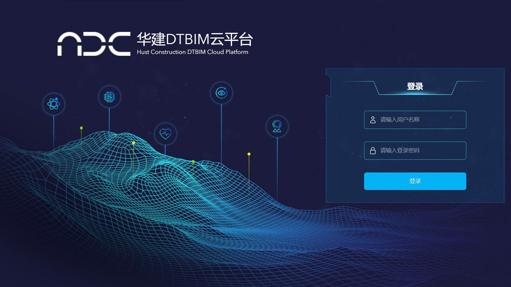
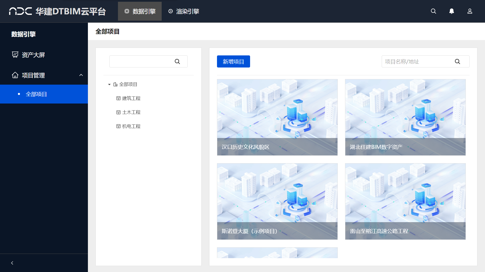
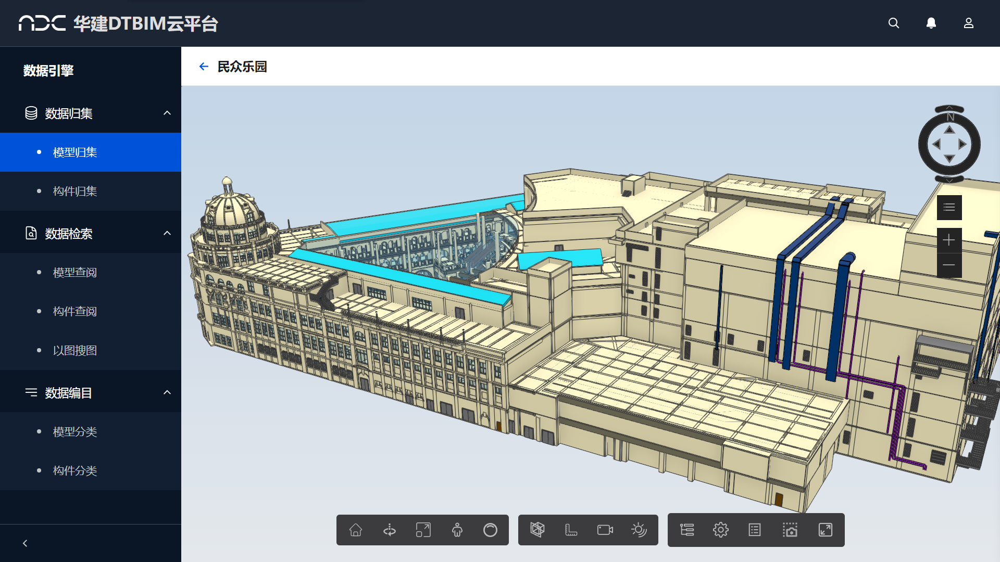
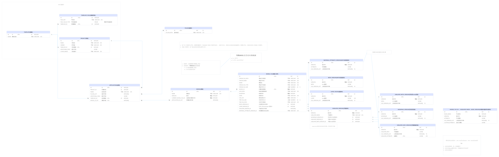

# 华建DTBIM云平台
华建DT- BIM项目个人成果展示：参与Web平台后端模型转换和模型管理部分的研发

## 项目简介

基于Web端的BIM+GIS云平台

创建、管理和可视化建筑项目的数字化工具，主要用于工程上的项目协作、设计优化、成本估算和施工规划等
### 登录页面

### 界面总览

### 模型浏览器

### 项目特色
1. 支持BIM模型、点云模型、倾斜摄影等文件格式
2. 集模型转换功能与模型轻量化功能于一体
3. 实现了独有融合格式UBM，获得多项专利和软件著作权
4. 完全自研国产，性能优越

## 个人主要工作与贡献
### OSGB倾斜摄影模型导出器部分
1. 使用官方API解析OSGB格式文件，获取单个tile的mesh信息以及uv和贴图等材质信息
2. 解析整个OSGB文件的LOD信息和节点树的结构
3. 将解析后的OSGB文件输出为一个中间格式以便后续处理
### 后台模型管理器部分
1. 参与技术选型，最终确定模型管理器的技术架构为：
异步Python框架Fast-API + 数据库Postgresql + 关系对象映射模型Sqlalchemy + 缓存Redis
2. 参与数据库设计，整体设计如下图所示：

3. 设计实现和测试主要的API接口，如获取修改和添加模型构件，构件材质信息，模型分层信息和节点属性等接口

### 后台模型转换器部分
1. 编写调试模型转换器与模型管理器之间的通信接口
2. 使用Celery做任务队列，将模型转化包装为异步任务，实现初步的分布式任务调度
### 接口自动化测试脚本
1. 编写实现模型后台接口的测试工具
2. 自动化的冒烟测试，完整测试流程为模型创建，模型关联，模型上传，模型转化，属性获取及属性编辑
3. 跑完测试流程后生成可视的测试报告，展示每个接口的日志输出、返回响应和耗时
    