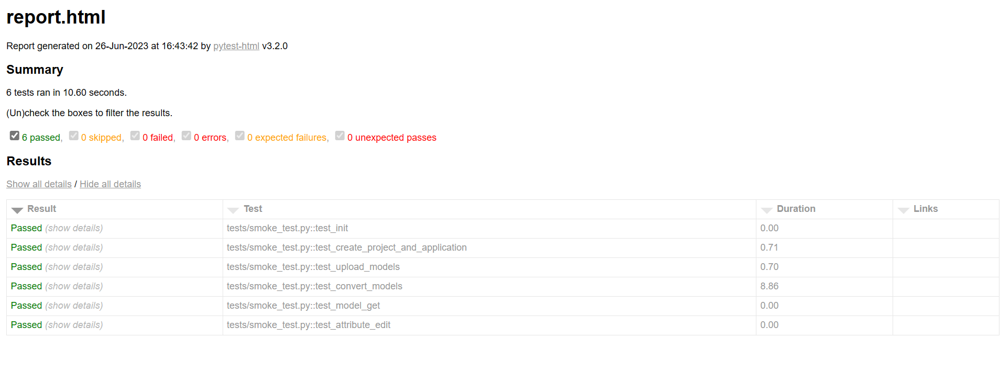

# MYPJ2108-UBM-Tester

2108项目的测试工具集

# 冒烟测试

测试地址从配置文件中读取

输入：冒烟测试用的模型文件夹，其下有若干个模型（jrvt）

输出：测试报告

测试流程：

1. 测试脚本使用接口创建测试项目
2. 使用接口创建应用并关联到项目
3. 使用接口创建模型文件并关联到应用
4. 上传文件
5. 发起转化任务
6. 轮询转化状态
7. 转化完成后，模拟前端请求完整的slpk文件
8. 测试属性编辑及对应请求

以上流程跑完之后生成测试报告，主要报告功能的可靠性，如果任意环境报错则终止测试直接报告测试不通过。

后续如果有新增功能也需要加入到冒烟测试的环节。

# 使用教程：
1. 使用`pytest -s tests/smoke_test.py --path 测试模型文件夹 --html=report.html --self-contained-html --capture=sys
`运行基本功能测试
2. 后续测试用例添加到test_cases文件夹中，测试用例采用json文件存储，具体方式参照代码实际使用
3. 生成的测试报告示例如下: